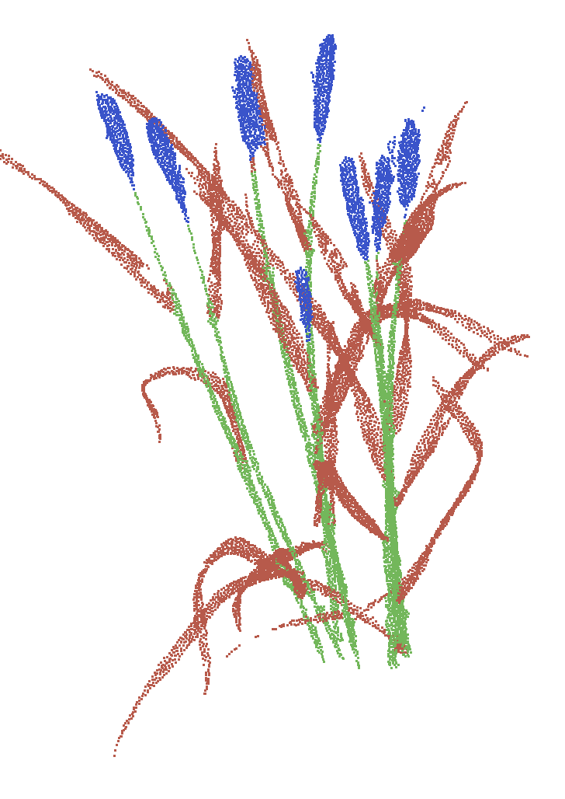

# ICFMNet

We provide code for reproducing results of the paper [**ICFMNet: An Automated Segmentation and 3D Phenotypic Analysis Pipeline for Plant, Spike, and Flag Leaf type of Wheat**]

Author: Pengliang Xiao, Sheng Wu, Shiqing Gao, Weiliang Wen, Chuanyu Wang, Xianju Lu, Xiaofen Ge, Wenrui Li, Linsheng Huang, Dong Liang, and Xinyu Guo

## Introduction

Three-dimensional high-throughput plant phenotyping technology offers an opportunity for simultaneous acquisition of plant organ traits at the scale of plant breeders. Wheat, as a multi-tiller crop with narrow leaves and diverse spikes, poses challenges for organ segmentation and measurement due to issues such as occlusion and adhesion. Therefore, building on previous research, this paper establishes a phenotyping pipeline and develops a 3D phenotypic automated analysis system for individual wheat plants at different growth stages. This system enables automated and precise three-dimensional phenotypic acquisition and analysis of wheat plant architecture, spike morphology, and flag leaf traits. To address the challenges posed by the significant structural differences among wheat spikes, leaves, and stems, as well as their compact spatial distribution, we propose a point cloud segmentation model based on deep learning called ICFMNet. ICFMNet relies on an instance center feature matching module, which extracts features from each instance's central region and matches them with global point-wise features by computing feature similarity. This approach enables precise instance mask generation independent of the spatial structure of the point cloud. In the organ point cloud segmentation tests for wheat spikes, stems, and leaves, the semantic segmentation achieves mPrec, mRec, and mIoU values of 95.9%, 96.0%, and 92.3%, respectively. The instance segmentation attains mAP and mAR scores of 81.7% and 83.0%, respectively.

## Pretrained models

[model](https://pan.baidu.com/s/1udAKrwmaLnci1ClmOUJKWA?pwd=ksgh)

## Visualization

| | z1 | z2 | z4 | z5 | z6 | z8 | z9 | z10 |
|:----------:|:----:|:-----:|:-----:|:-----:|:-----:|:-----:|:-----:|:-----:|
| Semantic segmentation |  |  |  |  |  |  |  |  |
| Instance segmentation |  |  |  |  |  |  |  |  |

## References

Code is built based on [SPFormer](https://github.com/sunjiahao1999/spformer), [SoftGroup](https://github.com/thangvubk/softgroup), and [spconv](https://github.com/traveller59/spconv)
